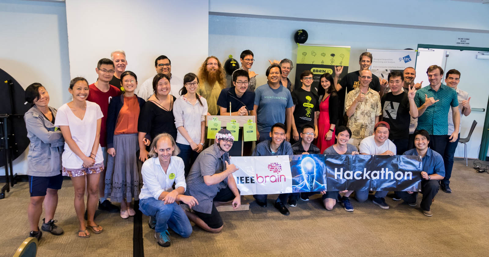
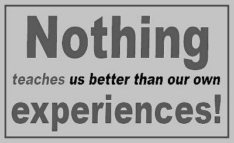

*Final picture of the entire hackathon participants*

# My thoughts on the BR41N 2018 hackathon

## Initial thoughts

My initial thoughts when I first joined this Hackathon, was both excitement and fear. I was excited that I was participating in my first hackathon. However, I was also afraid of having to present in front of, so much people and I also was unsure of what to do. The only web design class that I took so far was ICS 314. However, I was more focused on the front-end portion and knew very little of the backend portion. So, I had to also depend on my team for support and help and I was hoping that the team that I picked would help me on this hackathon adventure.

## Trouble

The first instance of trouble was when my teammates showed less and less effort in coming into meetings or putting effort into the project. Trying to set up meetings was nearly impossible since everyone had busy schedules. Others would make the hackathon less of a priority and deeming their school more important. With less effort came less interest in the group. Another problem was people unable to adapt to new frameworks or developer tools such as Angular and Flask. It took nearly an entire week to understand and get used to the programs (I forgot how to use meteor), fortunately we had people in our group that knew how to run these programs. 

## Progress on project

Our progress on the project was slow, at first, we were unsure on what type of project that we wanted to do. At first, we were thinking of doing the Aloha+ challenge however we felt that it was more of a social media tool and that it wouldn't make a significant impact in the community. So, we decided to go with the Office of Hawaiian Affairs since we thought that the project would help people in getting grants. Then we had issues coming up with our frameworks and developer tools as I mentioned before. As soon as we got that out of the way we were able to come up with a prototype website. Then came the huge gap where no one wanted to do anything because they were either busy with work and school or provided little interest in the project. I was able to work on the front end of the project, however when it came to the backend and other frameworks I had little experience and the project was pretty much halted. Finally, one of our teammates came to the rescue and implemented matplotlib, a python 2d plotting library. It wasn't pretty, but it was better than nothing. 

## Experience from this HACC

One of the biggest thing that I learned from this hackathon was the experience of attending a hackathon. This is my first time participating in a hackathon, so it was important to take that information that I experienced and put it into effective use. Hopefully with the experience I gained from this hackathon will help me avoid future mistakes in any projects or hackathons. The HACC 2017 has brought me closer to attending future hackathons. Other experiences that I have learned from this hackathon was more of a reminder or re-learning of web design. However, an old dog still can learn new tricks and I did learn new platforms, programs and developer tools such as Angular, Flask, Bootstrap, and DevPost. 

## What I would do next time

One important thing that I would do next time is to choose my teammates more carefully. I realize that just because your team knows what to do doesn't come out to the best results. For example, just because your entire team has been through multiple hackathons and is an expert at app creation doesn't mean it’s going to be the best team. The most important qualities I would look for would be teamwork and commitment. I could care less if my teammates have a lack of knowledge in website or app building. A team that doesn't put the effort to work won't give results, no matter how good they are with programming. The second thing that I would do is to practice my coding and design skills. It took me a while to remember how to implement basic functions like bootstrap into my program. My lack of knowledge of the backend portion of our project shows the lack of reliability to my teammates. Third I would expand my knowledge of the different platforms and frameworks that are available. The lack of knowledge of the different platforms and frameworks hindered my ability to use them during the hackathon. I had so many issues of trying to implement a carousel with bootstrap. Only to find myself using a different framework since I couldn't implement it. 

## Update

After the hackathon I'm proud enough to say that I have a good working functional website. I think it was the additional freedom that I had after the midterms or probably the additional time without the stress of a due date to study and figure out the concepts behind some of the frameworks or developer tools. I was able to implement highcharts as an addition to our website. I was also able to make a complete overhaul of the design in our website. Fresh new cards, a video tutorial, a survey and dropdown footers. I wanted to add images or a fancier design to the website but then again this is technically supposed to look like a government website and our focus was on the charts. 

## Conclusion

In conclusion, as much as a fiasco that this hackathon was for me I wouldn't mind participating in another hackathon next year. It was hard for me this year since I had other classes and the lack of knowledge that I had in website building and design. I was able to adapt and get better after the hackathon and I now understand a lot more about the developer tools and frameworks that exist out there. I still have a lot to learn and I won't get any better by just working alone. Hackathons can help me meet new people and work in a team. After all, in every small or big business, you'll find yourself working in a small or big team. Besides I don't think I could have ever done half the stuff that I did without a teammate. If anything, I think a computer science job should have a group project or hackathon as a requirement. 

*As I state AGAIN: Experience is the best teacher in the world*
