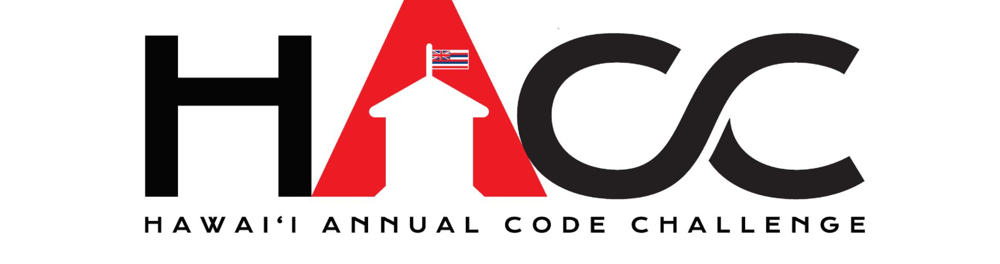

*Logo of the 2017 annual HACC*

# My thoughts on the HAAC 2017

## Initial thoughts

My inital thoughts when I first joined this Hackathon, was both excitment and fear. I was excited that I was participating in my first hackathon. However I was also afraid of having to present in front of so much people and I also was unsure of what to do. The only web design class that I took so far was ICS 314. However I was more focused on the front end portion and knew very little of the backend portion. So I had to also depend on my team for support and help and I was hoping that the team that I picked would help me on this hackathon adventure.

## Trouble

The first instance of trouble was when 

## Progress on project

## Final day presentation moments

"I don't want to present my project" - I thought to myself as I went on stage. As I went up to the stage I knew that I was unprepared and my lack of team efforts were shown at our presentation. I 

## Experience from this HACC

One of the biggest thing that I learned from this hackathon was 

## What I would do next time

One important thing that I would do next time is to choose my teamates more carefully. I realize that just because your team knows what to do doesn't come out to the best results. For example just because your entire team has been through multiple hackathons and is an expert at app creationg doesn't mean its going to be the best team. The most important qualities I would look for would be teamwork and commitment. I could care less if my teamates have a lack of knowledge in website or app building. A team that doesn't put the effort to work won't give results, no matter how good they are with programming. The second thing that I would do is to practice my coding and design skills. It took me a while to remember how to implement basic functions like bootstrap into my program. My lack of knowledge of the backend portion of our project shows the lack of reilability to my teamates. Third I would expand my knowledge of the different platforms and frameworks that are available. The lack of knowledge of the different platforms and frameworks hindered my ability to use them during the hackathon. I had so many issues of trying to implement a carasol with bootstrap. Only to find myself using a different framework since I couldn't implement it. 

## Conclusion

In conclusion, I can’t say a lot good things about Meteor, this is my first time building a website using Meteor and the first class to make a website in general. I’ll admit it’s hard trying to learn it but at the same time it makes it easy to avoid filtering around the heading, margins, and unnecessary items I must change. I still have a lot to learn so I think I’ll keep my head up high as I go through the wonders (or torturous) path with Meteor. 

*In the Army, we always had to be Subject Matter Experts (SME) in our profession, even if we had to pretend to*
