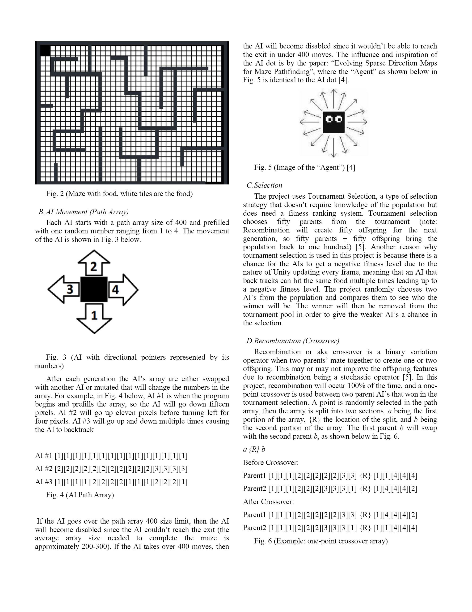
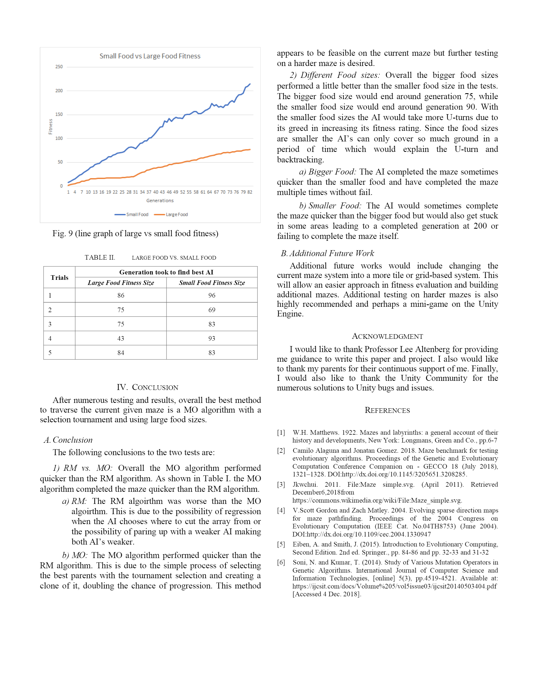

The link to the paper can be found in the Mini Repo: 

<a href="https://github.com/jjhna/Mini/blob/master/Na%2C%20Jonathan%20ICS%20674%20Final%20Project%20Paper.pdf"><i class="large github icon "></i>Maze Paper</a>

or 

<a href="https://github.com/jjhna/Mini"><i class="large github icon "></i>Mini Repo</a>

