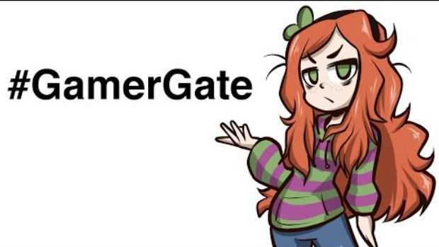

*The internet in a nutshell*

### Ethics today

When you think of breaking a code of ethics you think of someone stealing money from the cash register or fudging numbers on your own payroll. However, in the world of software engineering the term “ethics” can be quite different from the examples that I just gave. For example, stealing parts of a code from someone else or online harassment. Crimes that can be easier to get away with or crimes easily done at a click of a button. Therefore, in software engineering “ethics” takes a whole new meaning than just “ethics” in the regular world. 

### Gamergate online harassment 

The gamergate controversy started in Fall 2014 when anonymous people started to accuse Zoe Quinn of using relationships with a game journalist to get favorable reviews for a video game that she made. These accusations also included people sending death threats and doxing to Zoe Quinn. Internet groups then created an organization under #Gamergate to campaign against poor journalistic ethics (ex: quid quo pro). Ironically there wasn’t any organization under this group which lead to critics to believe gamergate as a group that right wing group that is against progressivism. They weren’t completely wrong; internet trolls sent death threats and dox Zoe Quinn. Death threats are illegal and doxing can potentially harm others (such as swatting). 

### Opinion

Honestly there really isn’t a solid solution against online harassment. A hundred years ago people could send death threats or harassment through snail mail. Today it’s just quicker for these harassers to send a message and harder to catch them. I would suggest new laws can make it easier to convict these people but people outside international borders can still freely say what they want. Perhaps strict control over who can sign up or log in can deter random people from harassing you but then again websites like Facebook don’t require you to have your social security number or an ID card. There really isn’t a solution when thousands of people are sending you death threats or calling out your mother. In a situation like that the best way to avoid more harassment might be to get off the web for a while, angry responses or confrontation with these people will just add fuel to the fire and glee for the trolls. However, doxing is a real threat and companies should provide better protection for your personal information but with the recent hacks (Sony, Yahoo, etc.…) it’s still up to you to safeguard your information and keep a lookout for any suspicious activity. The internet can be a frightening place and it can be easy to have a target painted on you. The authorities can do so much in their power to protect us but it’s up to us to defend against online harassment. 

## Resources: 

https://en.wikipedia.org/wiki/Gamergate_controversy 

https://www.washingtonpost.com/news/the-intersect/wp/2014/10/14/the-only-guide-to-gamergate-you-will-ever-need-to-read/?utm_term=.0d6ba4c14f8b

