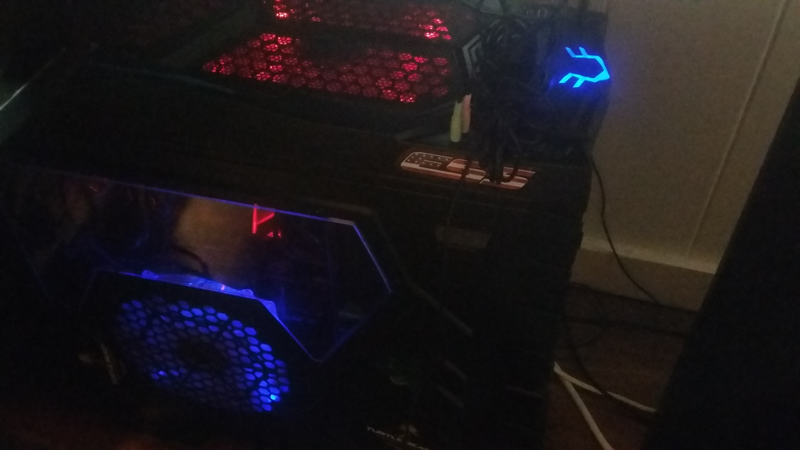
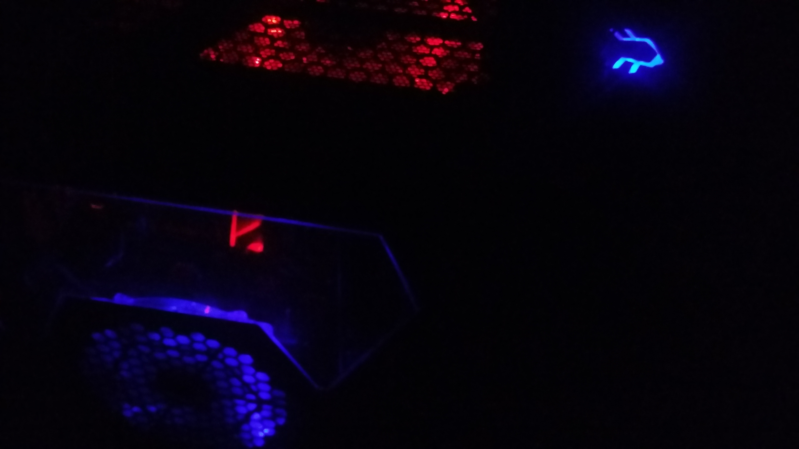

It's pretty cool...
  
  
  
  ...except when your trying to sleep...
  

In order to buy the right computer there is a lot of questions that you have to answer.
Some of these questions include: 
1. Do you need a computer outside your house? - laptop
2. Are you heavy into video games - An intel core i7, with NVdia graphics card may be needed.
...
etc.

Since I play a lot of video games at home I decided to buy a desktop. However since I had a lot of video games I was convinced by my friend to build a computer. In order to do this I decided to build my own computer since it was also a lot more cheaper and more flexible to my budget. Why you might ask? Well if a computer part were to fail in a pre-packaged desktop you might not be able to buy a cheaper or expensive replacement part for your computer since the case might be too small or unsuitable. Just remember that the more money you spend means the more options you have but try to make a budge before hand. 

Another thing to remember is that you can't build a laptop so in this case choosing which brand, and built in components are a key factor in figuring out the perfect laptop. 

This project may take an entire day to do so make sure you:
1. Make a budget
2. Decide which computer suits you
3. Shop far and wide, (Amazon, Newegg, best buy, even ebay)
4. Reconsider before buying, get a 2nd opinion 
